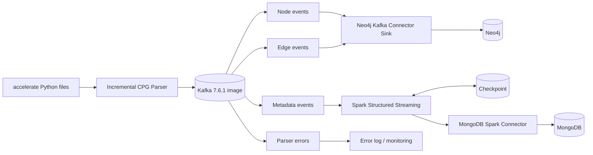

# Architecture Diagram

```mermaid
flowchart LR
    SRC[accelerate Python files] --> PARSER[Incremental CPG Parser]
    PARSER --> KAFKA[(Kafka 7.6.1 image)]

    KAFKA --> NODE[Node events]
    KAFKA --> EDGE[Edge events]
    KAFKA --> META[Metadata events]
    KAFKA --> ERROR[Parser errors]

    NODE --> NEO4JC[Neo4j Kafka Connector Sink]
    EDGE --> NEO4JC
    NEO4JC --> NEO4J[(Neo4j)]

    META --> SPARK[Spark Structured Streaming]
    SPARK <--> CHECKPOINT[(Checkpoint)]
    SPARK --> MONGOC[MongoDB Spark Connector]
    MONGOC --> MONGO[(MongoDB)]

    ERROR --> LOGS[Error log / monitoring]
```

Graph topology không đi qua Spark. Version Neo4j/Spark/MongoDB cần đồng bộ với
Docker Compose cuối cùng của người phụ trách Phần 3 và Phần 4 trước khi nộp.
