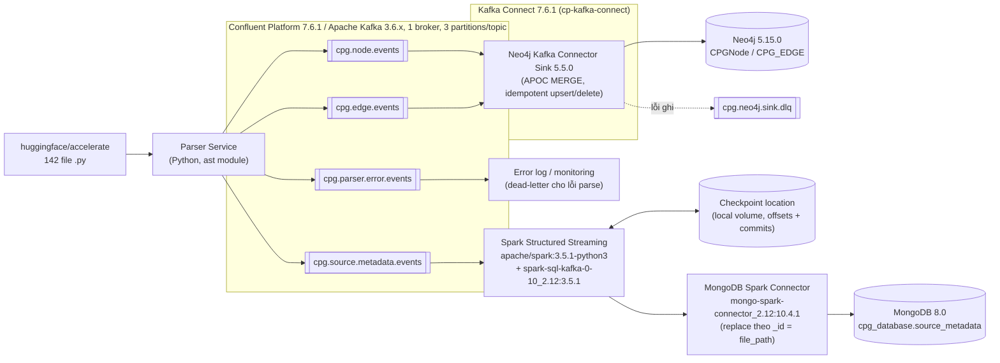
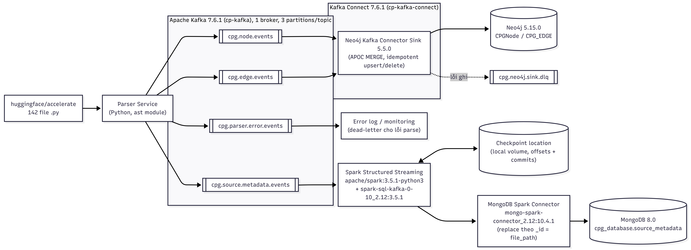

# Architecture Diagram

## 1. Sơ đồ tổng thể

### 📸 Ảnh render sẵn (dùng khi môi trường build không bật extension Mermaid)

> **Chú thích version trong ảnh tĩnh:** `cp-kafka:7.6.1` là tag image của
> Confluent Platform; Apache Kafka runtime tương ứng là 3.6.x. Sơ đồ Mermaid
> phía trên đã ghi tách hai version này để tránh nhầm lẫn.

**Điểm mấu chốt của kiến trúc** (bám sát yêu cầu đề "ingest graph topology vào Neo4j
*không qua Spark*"): nhánh `cpg.node.events`/`cpg.edge.events` → Neo4j đi thẳng qua Kafka
Connect, hoàn toàn tách biệt khỏi nhánh `cpg.source.metadata.events` → Spark → MongoDB.
Hai nhánh chạy song song, độc lập, không phụ thuộc lẫn nhau.

Hệ thống có **2 đường lỗi tách biệt**, dễ nhầm nên ghi rõ:
- `cpg.parser.error.events` — lỗi phát sinh ngay tại **Parser Service** khi parse 1 file
  (ví dụ syntax error), được phát trước khi có dữ liệu gửi tới Neo4j/MongoDB.
- `cpg.neo4j.sink.dlq` — lỗi phát sinh **sau đó**, ngay tại Kafka Connect khi ghi vào Neo4j
  thất bại (ví dụ constraint vi phạm, mất kết nối) — cơ chế dead-letter-queue riêng của
  Kafka Connect, không liên quan tới lỗi parse.

## 2. Bảng công cụ và version cụ thể

| Thành phần | Image / package | Version |
|---|---|---|
| Message broker image | `confluentinc/cp-kafka` | Confluent Platform 7.6.1 |
| Kafka runtime trong image | Apache Kafka | 3.6.x |
| Coordination | `confluentinc/cp-zookeeper` | 7.6.1 |
| Kafka Connect worker | `confluentinc/cp-kafka-connect` | 7.6.1 |
| Neo4j Sink plugin | Neo4j Kafka Connector | 5.5.0 |
| Graph database | `neo4j` | 5.15.0 |
| Document database | `mongo` | 8.0 |
| Compute engine | `apache/spark` (python3) | 3.5.1 |
| Spark ↔ Kafka connector | `spark-sql-kafka-0-10_2.12` | 3.5.1 |
| Spark ↔ MongoDB connector | `mongo-spark-connector_2.12` | 10.4.1 |
| Parser | Python `ast` (standard library) | Python 3.12.10 |

Lưu ý: `7.6.1` là tag của **Confluent Platform image**, không phải version Apache
Kafka. Theo [bảng tương thích chính thức của Confluent Platform
7.6](https://docs.confluent.io/platform/7.6/installation/versions-interoperability.html),
dòng 7.6.x sử dụng Apache Kafka 3.6.x.

## 3. Luồng dữ liệu tóm tắt

1. Parser Service đọc từng file `.py`, xây CPG (AST/CFG/DFG/Call), so sánh với
   `parser_state` của lần chạy trước để tính đúng phần cần thêm/xoá (idempotent).
2. Phát 4 loại event lên 4 topic Kafka riêng biệt, mỗi message có `schema_version` và
   `event_time`.
3. Nhánh đồ thị: Kafka Connect (Neo4j Sink) tiêu thụ `cpg.node.events`/`cpg.edge.events`,
   dùng Cypher `MERGE` theo `node_id`/`edge_id` ổn định (SHA-256) để upsert/delete đúng,
   không qua Spark.
4. Nhánh metadata: Spark Structured Streaming tiêu thụ `cpg.source.metadata.events`, ghi
   vào MongoDB bằng chế độ `replace` theo `_id = file_path`, dùng checkpoint để resume
   đúng offset khi job bị restart (đã kiểm chứng thực nghiệm ở Việc 6).

## 4. Reflection

Điểm quan trọng nhất của thiết kế là tách graph topology và source metadata thành hai
nhánh độc lập. Node/edge đi thẳng từ Kafka qua Neo4j Connector để tránh biến Spark
thành nút nghẽn không cần thiết; Spark chỉ đảm nhiệm nhánh metadata cần xử lý streaming
và checkpoint. Stable ID cùng thao tác `MERGE`/`replace` giúp cả hai sink chịu được
replay mà không tạo bản ghi trùng.

Giới hạn của mô hình lab là một broker và replication factor 1 nên chưa chịu lỗi như
production. Checkpoint cục bộ cũng cần chuyển sang storage bền vững khi triển khai
thật. Ngoài ra, `cpg.parser.error.events` và `cpg.neo4j.sink.dlq` phải được giám sát
riêng vì chúng biểu diễn lỗi ở hai giai đoạn khác nhau: parse source và ghi graph.
