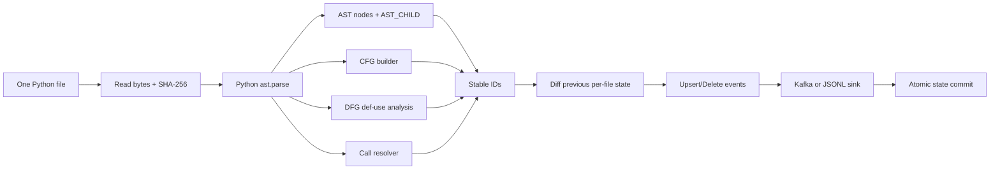

# Task 2 - Incremental CPG Parser Service

## 1. Mục tiêu và lựa chọn kỹ thuật

Parser Service phân tích source Python của `huggingface/accelerate` theo từng
file. Nhóm chọn thư viện chuẩn `ast` vì không cần chạy hoặc import source code,
không cần dịch vụ Joern riêng và đủ để minh họa AST, CFG, DFG và Call graph
trong phạm vi lab.

Mỗi vòng xử lý chỉ giữ AST và các event của một file. Sau khi publish và flush,
state của file được ghi atomically rồi dữ liệu file đó được giải phóng. Danh
sách 142 đường dẫn có thể nằm trong bộ nhớ nhưng nội dung của 142 file không
được load đồng thời.

## 2. Luồng xử lý một file



Nếu file lỗi syntax hoặc UTF-8, service phát một `parse_error` vào error topic
và tiếp tục file kế tiếp. State cũ không bị ghi đè khi parse/publish thất bại.

## 3. CPG được trích xuất

### AST

Mỗi `ast.AST` sinh một node. Quan hệ cha-con sinh edge `AST_CHILD`, kèm field
AST và index nếu child nằm trong list.

### CFG

CFG được dựng riêng cho module, function và method. Parser hỗ trợ luồng tuần
tự, `if/else`, `for/while`, `break`, `continue`, `return`, `with` và
`try/except/finally` ở mức intraprocedural phù hợp lab. Thuộc tính `branch`
phân biệt `NEXT`, `TRUE`, `FALSE`, `LOOP_BODY`, `LOOP_EXIT`, v.v.

### DFG

Parser theo dõi definition gần nhất của biến trong từng lexical scope. Load của
biến sinh edge `DFG` từ definition đến node sử dụng, với
`properties.flow = DEF_USE`. Argument, assignment target, loop target, import,
function và class name đều được xem là definition.

Phân tích này là static approximation: không mô phỏng aliasing, dynamic
attribute hoặc control-dependent reaching definitions giữa nhiều branch.

### Call graph

Caller là module/function/method đang chứa `ast.Call`. Hàm và method định nghĩa
trong cùng file được resolve đến node thật. Builtin, thư viện ngoài hoặc target
động được biểu diễn bằng node `ExternalSymbol` ổn định theo file.

## 4. Stable ID và idempotent replay

Node ID dùng SHA-256 của:

```text
repository + file_path + lexical_scope + node_type + semantic_signature + occurrence
```

Edge ID dùng:

```text
edge_type + src_node_id + dst_node_id + stable_anchor
```

`event_time` không tham gia tạo ID. Vì vậy cùng nội dung sinh cùng tập ID dù
thời điểm chạy khác nhau. State JSON riêng theo file lưu content hash, node IDs
và edge IDs. Khi source đổi, service diff state để phát `edge_delete` trước
`node_delete`, sau đó phát toàn bộ upsert mới.

State chỉ được commit sau khi Kafka futures hoàn tất, tránh đánh dấu file đã xử
lý khi broker chưa nhận đủ event.

## 5. Kafka contract

| Event | Topic | Kafka key |
|---|---|---|
| `node_upsert`, `node_delete` | `cpg.node.events` | `file_path` |
| `edge_upsert`, `edge_delete` | `cpg.edge.events` | `src_node_id` |
| `source_upsert` | `cpg.source.metadata.events` | `file_path` |
| `parse_error` | `cpg.parser.error.events` | `file_path` |

Mọi event có `schema_version = 1.0.0`, `event_time` ISO-8601 UTC và
`event_type`. Node/edge IDs được dùng làm khóa `MERGE` bên Neo4j; `file_id`
hoặc `file_path` được dùng làm khóa upsert metadata bên MongoDB.

Ví dụ metadata thật của `accelerator.py`:

```json
{
  "schema_version": "1.0.0",
  "event_type": "source_upsert",
  "file_path": "src/accelerate/accelerator.py",
  "repository": "huggingface/accelerate",
  "loc": 4359,
  "size_bytes": 201947,
  "content_sha256": "8df2adef187bb2c15c937d0941c9b0ee2bddd4a2ddd503695055422ad2d83ecc",
  "counts": {
    "nodes": 16139,
    "edges": 20448,
    "ast_child_edges": 15836,
    "cfg_edges": 1877,
    "dfg_edges": 1882,
    "call_edges": 853
  }
}
```

## 6. Lệnh chạy

```bash
python -m pip install -r requirements.txt

# Một file, không cần Kafka
python -m parser_service --repo accelerate \
  --file src/accelerate/accelerator.py --dry-run \
  --output-jsonl output/parser_events_smoke.jsonl

# Toàn manifest, không lưu payload
python -m parser_service --repo accelerate \
  --manifest output/file_discovery.json --discard-events

# Publish Kafka thật
python -m parser_service --repo accelerate \
  --manifest output/file_discovery.json \
  --bootstrap-servers localhost:9092

# Task 6: chỉ reprocess file vừa sửa
python -m parser_service --repo accelerate \
  --file src/accelerate/accelerator.py \
  --bootstrap-servers localhost:9092
```

## 7. Kết quả thực tế

| Kiểm tra | Kết quả |
|---|---:|
| Unit/integration tests | 12 passed |
| File trong manifest | 142 |
| Parse thành công | 142 |
| Parse thất bại | 0 |
| Tổng node | 193,389 |
| Tổng edge | 241,063 |
| AST_CHILD | 187,840 |
| CFG | 20,573 |
| DFG | 21,245 |
| CALL | 11,405 |
| Replay không đổi với `--skip-unchanged` | 142/142 skipped |
| Peak allocation khi parse `accelerator.py` | 31.17 MiB |
| Kafka topic verification | 4/4 PASS |
| Kafka publish/consume node, edge, metadata, error | PASS |

Các test xác minh stable ID, line shift, bốn loại edge, lexical scope của DFG,
internal/external call, replay không duplicate, delete event, skip unchanged,
syntax/encoding error và CLI JSONL.

Kafka thật dùng image `confluentinc/cp-kafka:7.6.1`, client
`kafka-python 2.3.2`. Service đã publish file
`src/accelerate/commands/accelerate_cli.py` và consume lại thành công node,
edge, metadata. Một fixture syntax lỗi tạm thời cũng tạo `parse_error` thật;
fixture đã được xóa sau khi kiểm tra.

## 8. Architecture Diagram toàn pipeline

> Sơ đồ kiến trúc chi tiết (kèm bảng version cụ thể từng thành phần) được trình
> bày đầy đủ ở **Chương 2 — Kiến trúc tổng thể**. Mục này chỉ giữ lại một câu
> tóm tắt để không lặp lại 2 sơ đồ khác nhau trong cùng cuốn sách: nhánh graph
> đi trực tiếp Kafka → Neo4j Kafka Connector → Neo4j, không qua Spark; chỉ
> nhánh metadata đi qua Spark Structured Streaming và MongoDB Spark Connector.

## 9. Reflection

`ast` hoạt động tốt cho bounded-memory parsing và tạo ID lặp lại được mà không
cần cài công cụ phân tích ngoài. Phần khó nhất là CFG của cấu trúc điều khiển và
DFG trong Python động. Phiên bản lab chọn intraprocedural CFG và lexical
last-definition DFG; giới hạn được nêu rõ thay vì tuyên bố phân tích semantic
hoàn chỉnh. State theo file giải quyết replay và cleanup phần tử đã mất, đồng
thời giúp Task 6 chỉ chạy lại đúng file được sửa.
