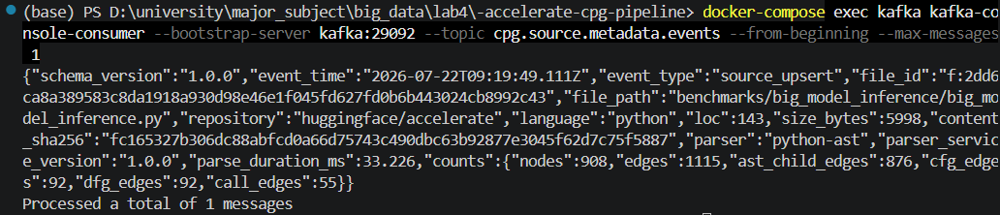
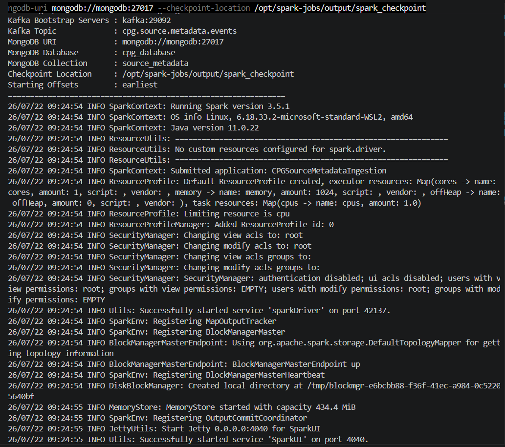
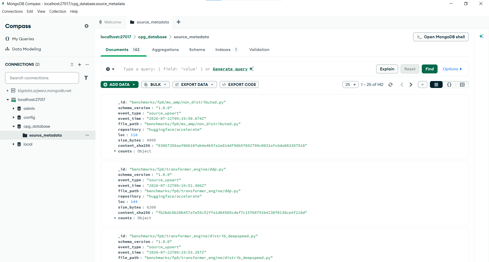
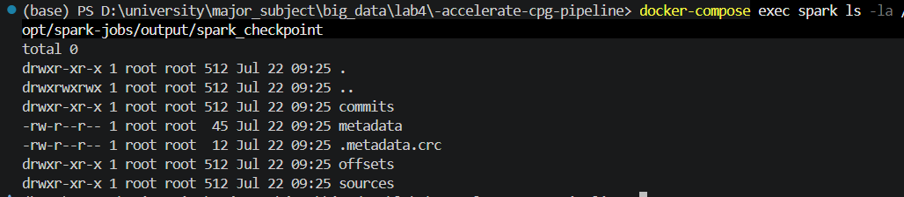

# Task 5 - Source Metadata Ingestion vào MongoDB bằng Spark Structured Streaming

## 1. Mục tiêu của Task

Task 5 thuộc **Phần 4 – Việc 5** của đồ án. Mục tiêu là xây dựng một pipeline streaming để:

1. Đọc các sự kiện metadata từ Kafka topic `cpg.source.metadata.events`.
2. Xử lý dữ liệu bằng **Apache Spark Structured Streaming**.
3. Ghi metadata của từng file Python vào **MongoDB**.
4. Sử dụng **checkpoint** để Spark có thể khôi phục trạng thái khi job bị dừng hoặc khởi động lại.
5. Đảm bảo tính **idempotent** ở tầng ghi (write logic), tức là xử lý lại cùng một file không tạo ra document trùng trong MongoDB.

Luồng dữ liệu:

```text
Parser Service
      │
      ▼
Kafka: cpg.source.metadata.events
      │
      ▼
Spark Structured Streaming
      │
      ├── Đọc JSON
      ├── Parse Schema
      ├── Map file_path → _id
      └── Ghi dữ liệu theo streaming
      │
      ▼
MongoDB
Database: cpg_database
Collection: source_metadata
```

---

## 2. Kiến trúc tổng thể

```text
+------------------------------------+
| Kafka Topic:                       |
| cpg.source.metadata.events         |
+-----------------+------------------+
                  |
                  | Streaming Read
                  v
+-----------------+------------------+
| Apache Spark Structured Streaming |
|                                    |
| - Read Kafka                      |
| - Parse JSON Schema               |
| - Map file_path -> _id            |
| - Process micro-batches           |
+-----------------+------------------+
                  |
                  | Idempotent Upsert / Replace
                  v
+-----------------+------------------+
| MongoDB                           |
|                                    |
| Database: cpg_database             |
| Collection: source_metadata        |
+------------------------------------+
```

---

## 3. Điều kiện tiên quyết

Kiểm tra nhanh 3 service cần cho Task 5 đang chạy:

```powershell
docker-compose up -d
docker-compose ps kafka mongodb spark
bash scripts/create_topics.sh         # ./scripts/create_topics.ps1
```

---

## 4. Kiểm tra Kafka Topic cần dùng

Task 5 sử dụng topic `cpg.source.metadata.events`.

```powershell
docker-compose exec kafka kafka-topics --bootstrap-server kafka:29092 --describe --topic cpg.source.metadata.events
```

---

## 5. Tạo dữ liệu metadata bằng Parser Service

Spark không tự tạo dữ liệu, chỉ đọc dữ liệu đã có trong Kafka. Cần chạy **Parser Service** (Việc 2) để publish metadata event.

**Toàn bộ manifest:**
```powershell
python -m parser_service --repo accelerate --manifest output/file_discovery.json --bootstrap-servers localhost:9092
```

### 📸 Ảnh minh chứng 1 – Metadata event thật trong Kafka

Kiểm tra bằng console consumer:

```powershell
docker-compose exec kafka kafka-console-consumer --bootstrap-server kafka:29092 --topic cpg.source.metadata.events --from-beginning --max-messages 1
```

Event mẫu:

```json
{
  "schema_version": "1.0.0",
  "event_type": "source_upsert",
  "event_time": "...",
  "file_path": "...",
  "repository": "huggingface/accelerate",
  "loc": 143,
  "size_bytes": 5998,
  "content_sha256": "...",
  "counts": {
    "nodes": 908,
    "edges": 1115,
    "ast_child_edges": 876,
    "cfg_edges": 92,
    "dfg_edges": 92,
    "call_edges": 55
  }
}
```




Ảnh này chứng minh `Parser Service → Kafka` đã hoạt động trước khi Spark đọc dữ liệu.

---

## 6. Chạy Spark Structured Streaming Job

Mã nguồn: `scripts/spark_streaming_job.py`.

```powershell
docker-compose exec spark spark-submit --master local[*] --packages org.apache.spark:spark-sql-kafka-0-10_2.12:3.5.1,org.mongodb.spark:mongo-spark-connector_2.12:10.4.1 /opt/spark-jobs/scripts/spark_streaming_job.py --kafka-bootstrap-servers kafka:29092 --mongodb-uri mongodb://mongodb:27017 --checkpoint-location /opt/spark-jobs/output/spark_checkpoint
```

### 📸 Ảnh minh chứng 2 – Spark Job đang chạy



---

## 7. Kiểm tra dữ liệu trong MongoDB

**MongoDB Compass** (từ host, dùng `mongodb://localhost:27017`): mở database `cpg_database` → collection `source_metadata`.

Document mẫu:

```json
{
  "_id": "benchmarks/big_model_inference/big_model_inference.py",
  "schema_version": "1.0.0",
  "event_type": "source_upsert",
  "event_time": "2026-07-22T03:24:26.339Z",
  "file_path": "benchmarks/big_model_inference/big_model_inference.py",
  "repository": "huggingface/accelerate",
  "loc": 143,
  "size_bytes": 5998,
  "content_sha256": "...",
  "counts": {
    "nodes": 908,
    "edges": 1115,
    "ast_child_edges": 876,
    "cfg_edges": 92,
    "dfg_edges": 92,
    "call_edges": 55
  }
}
```

### 📸 Ảnh minh chứng 3 – MongoDB Compass



---

## 8. Kiểm tra Checkpoint của Spark

Checkpoint được cấu hình tại `/opt/spark-jobs/output/spark_checkpoint`:

```powershell
docker-compose exec spark ls -la /opt/spark-jobs/output/spark_checkpoint
```

### 📸 Ảnh minh chứng 4 – Spark Checkpoint




Checkpoint chứng minh Spark Streaming Job có cơ chế lưu trạng thái/offset để resume đúng khi restart.

---

## 9. Kết luận

Task 5 triển khai nhánh MongoDB của pipeline CPG (khác nhánh Neo4j dùng Kafka Connector Sink trực tiếp): Kafka → Spark Structured Streaming → MongoDB, với `file_path` map thành `_id` và `operationType = replace` để đảm bảo ghi idempotent, cùng checkpoint để resume đúng offset khi restart.

Việc kiểm chứng đầy đủ tính idempotent xuyên suốt toàn pipeline (Neo4j + MongoDB + Spark checkpoint skip file không đổi) được trình bày ở chương **Việc 6 — Idempotent Replay Verification**.