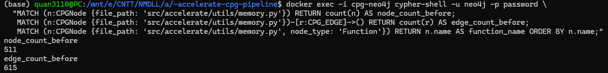
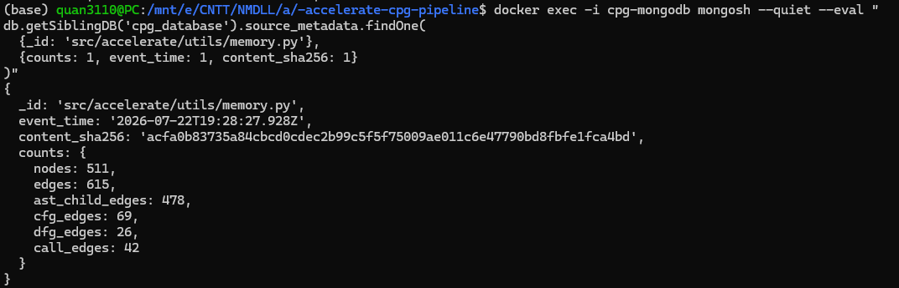
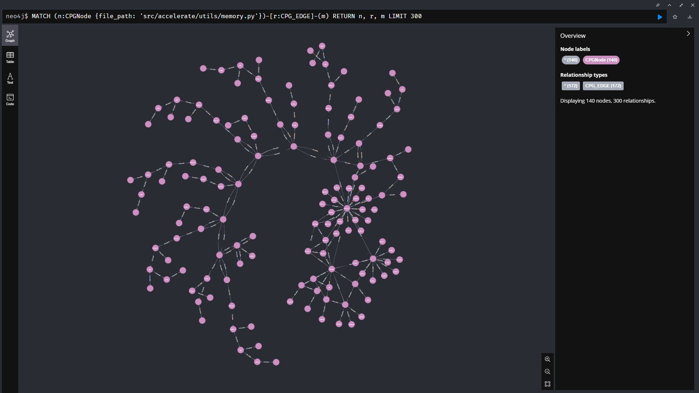
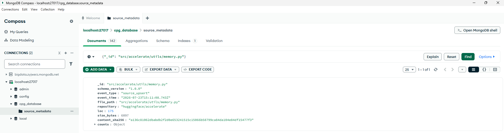
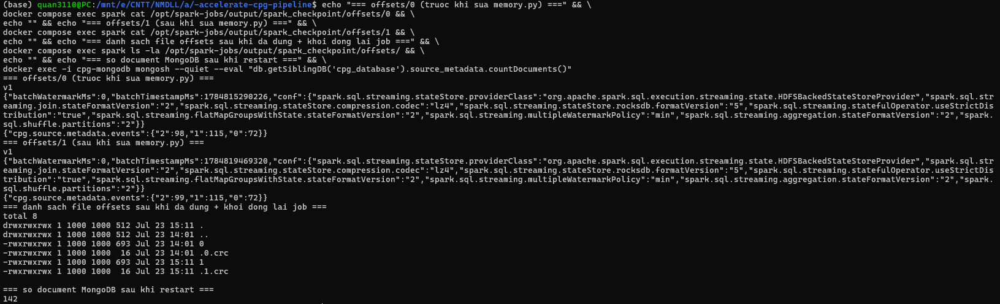

# Task 6 - Idempotent Replay Verification

## 1. Mục tiêu của Task

Task 6 là phần **chung**, không thuộc riêng Phần 1-4, yêu cầu người phụ trách Việc 2 (Parser
Service), Việc 4 (Neo4j) và Việc 5 (Spark + MongoDB) phối hợp kiểm chứng xuyên suốt cả
pipeline. Yêu cầu gốc của đề:

> Modify one Python source file in your cloned repository and reprocess that single file
> through the Parser Service. Verify that the node and edge counts in Neo4j reflect the
> update without creating duplicate nodes, that the MongoDB collection contains the updated
> metadata document for that file, and that the Apache Spark Structured Streaming checkpoint
> correctly skips already-processed offsets for all unchanged files.

Ba điều bắt buộc phải chứng minh bằng **dữ liệu thật** (không mô phỏng):

1. **Neo4j**: node/edge của file bị sửa cập nhật đúng, không tạo bản ghi trùng.
2. **MongoDB**: có document metadata mới nhất cho đúng file đó, không nhân bản document.
3. **Spark checkpoint**: bỏ qua các file không đổi, không xử lý lại từ đầu khi job bị
   restart.

---

## 2. Chuẩn bị hạ tầng trước khi test

Trước khi sửa file, đã kiểm tra lại toàn bộ 6 service (`docker compose ps`) và baseline dữ
liệu để đảm bảo số liệu đối chiếu sau này là chính xác, không bị lẫn với dữ liệu cũ do máy
từng khởi động lại qua đêm (xem sự cố #1/#3 đã ghi nhận trước đó trong quá trình làm Task 4).

Trong lúc kiểm tra, phát hiện Kafka Connect task của connector `cpg-neo4j-sink` đang ở trạng
thái `FAILED` (do worker khởi động trước khi Neo4j sẵn sàng hẳn sau lần restart gần nhất),
lỗi `ServiceUnavailableException: Connection refused`. Đã khắc phục bằng:

```bash
curl -X POST http://localhost:8083/connectors/cpg-neo4j-sink/restart?includeTasks=true
```

Sau khoảng 10 giây, connector trở lại `RUNNING`, số liệu Neo4j vẫn khớp baseline đã biết
(`193389` node / `241063` edge, breakdown `AST_CHILD 187840 / CALL 11405 / CFG 20573 /
DFG 21245`), DLQ (`cpg.neo4j.sink.dlq`) trống. Hạ tầng xác nhận sẵn sàng để test.

Job Spark Structured Streaming (Task 5) cũng được khởi động lại ở một terminal riêng
(chạy liên tục suốt quá trình test), và xác nhận resume đúng ngay từ đầu: số document
MongoDB vẫn là `142` ngay sau khi job khởi động lại, không bị ghi trùng.

---

## 3. Chọn file và kiểu sửa

**File được chọn:** `src/accelerate/utils/memory.py`

Lý do chọn:
- Đã có baseline rõ ràng từ lần chạy full 142 file: **511 node / 615 edge**.
- Đủ nhỏ để đối chiếu toàn bộ diff bằng tay, đủ lớn để có nhiều hàm thật, có lời gọi hàm
  chéo nhau.
- Đã tồn tại sẵn `parser_state` từ lần full-run trước, nên cơ chế tính diff
  (`node_delete`/`edge_delete`) của Parser Service có đủ dữ liệu tham chiếu để hoạt động
  đúng (xem `parser_service/state.py`, `parser_service/service.py`).

**Nội dung sửa** (chọn kiểu sửa chứng minh được cả 2 chiều cùng lúc, mạnh hơn "sửa vài
dòng"):

- **Xoá hẳn** hàm `release_memory(*objects)` — hàm độc lập, không hàm nào khác trong file
  gọi tới nó, nên tạo ra một diff "sạch", không ảnh hưởng dây chuyền tới hàm khác.
- **Thêm mới** hàm `log_memory_summary(prefix: str = "") -> None` ở cuối file.

6 hàm cấp cao (kể cả 2 hàm lồng bên trong `find_executable_batch_size`) trong file **trước
khi sửa**, lấy trực tiếp từ Neo4j:

| Hàm | scope | start_line |
|---|---|---|
| `clear_device_cache` | `<module>` | 40 |
| `release_memory` | `<module>` | 70 |
| `should_reduce_batch_size` | `<module>` | 100 |
| `find_executable_batch_size` | `<module>` | 119 |
| `reduce_batch_size_fn` | `find_executable_batch_size` | 160 |
| `decorator` | `find_executable_batch_size` | 165 |

---

## 4. Baseline "trước khi sửa"

**Neo4j** (`docker exec -i cpg-neo4j cypher-shell ...`):

```
node_count_before: 511
edge_count_before: 615
```

**MongoDB** (`db.source_metadata.findOne({_id: 'src/accelerate/utils/memory.py'}, ...)`):

```json
{
  "_id": "src/accelerate/utils/memory.py",
  "event_time": "2026-07-22T19:28:27.928Z",
  "content_sha256": "acfa0b83735a84cbcd0cdec2b99c5f5f75009ae011c6e47790bd8fbfe1fca4bd",
  "counts": {
    "nodes": 511, "edges": 615,
    "ast_child_edges": 478, "cfg_edges": 69, "dfg_edges": 26, "call_edges": 42
  }
}
```

### 📸 Ảnh minh chứng 1 - Baseline trước khi sửa





---

## 5. Chạy lại qua Parser Service

Sau khi sửa file, chạy lại **đúng 1 file** (không chạy lại cả manifest):

```bash
python -m parser_service --repo accelerate --file src/accelerate/utils/memory.py \
  --bootstrap-servers localhost:9092
```

Kết quả:

```
[1/1] SUCCEEDED src/accelerate/utils/memory.py nodes=537 edges=634
{
  "files_total": 1,
  "succeeded": 1,
  "failed": 0,
  "skipped": 0,
  "nodes": 537,
  "edges": 634,
  "deleted_nodes": 52,
  "deleted_edges": 74
}
```

`deleted_nodes`/`deleted_edges` > 0 (khác hẳn kết quả `0` của các lần idempotent không đổi
nội dung ở Task 4) - chứng minh Parser Service tự tính đúng diff dựa trên `parser_state` đã
lưu từ lần chạy trước, không phải publish lại toàn bộ file như dữ liệu mới hoàn toàn.

**Kiểm tra chéo độ hợp lý của số liệu:** dù chỉ đổi 1 hàm lấy 1 hàm, tổng node lại *tăng*
(511 → 537). Đối chiếu bằng cách tự đếm AST node của 2 hàm liên quan (module `ast` chuẩn,
`ast.walk`): `release_memory` (cũ) có khoảng 51 node, `log_memory_summary` (mới) có khoảng
75 node - nhiều hơn hẳn dù "nhìn gọn hơn", vì hàm mới dùng 2 f-string, và mỗi f-string bị
`ast` phân rã thành nhiều node con (`JoinedStr`, `FormattedValue`, format spec...). Số liệu
`deleted_nodes=52` khớp sát ước tính 51 (chênh lệch nhỏ do cách đếm node ranh giới), xác
nhận không có bug.

---

## 6. Kết quả kiểm chứng

### 6.1. Neo4j - cập nhật đúng, không trùng, không rò rỉ

```
node_count_after: 537
edge_count_after: 634
function_name (FunctionDef trong file): clear_device_cache, decorator,
  find_executable_batch_size, log_memory_summary, reduce_batch_size_fn,
  should_reduce_batch_size   -- KHÔNG còn "release_memory"
total_nodes_repo: 193415
total_edges_repo: 241082
```

| | Trước | Sau | Chênh lệch thực tế | Kỳ vọng tính tay |
|---|---|---|---|---|
| Node của `memory.py` | 511 | 537 | +26 | khớp report Parser Service |
| Edge của `memory.py` | 615 | 634 | +19 | khớp report Parser Service |
| Tổng node repo | 193389 | 193415 | +26 | 193389 − 511 + 537 = **193415** ✓ |
| Tổng edge repo | 241063 | 241082 | +19 | 241063 − 615 + 634 = **241082** ✓ |

Dead-letter queue (`cpg.neo4j.sink.dlq`) vẫn trống sau batch này - không có event nào bị
lỗi âm thầm.

### 📸 Ảnh minh chứng 2 - Neo4j Browser sau khi sửa (đồ thị con của memory.py)



*Ảnh trên chỉ hiển thị một phần đồ thị con của `memory.py` (câu truy vấn giới hạn
`LIMIT 300` quan hệ để dễ quan sát); tổng số thật của toàn bộ file là 537 node / 634 edge,
đã đối chiếu bằng `COUNT` ở bảng trên.*

### 6.2. MongoDB - document mới nhất, không nhân bản

```
total_documents: 142   (không đổi, không tăng thành 143)
{
  "_id": "src/accelerate/utils/memory.py",
  "event_time": "2026-07-23T15:11:08.743Z",
  "content_sha256": "a136c81062dbabdb2f2d0e653241515c15066b58799ca84da104e84df15477f3",
  "counts": {
    "nodes": 537, "edges": 634,
    "ast_child_edges": 502, "cfg_edges": 66, "dfg_edges": 24, "call_edges": 42
  }
}
```

`event_time` mới hơn, `content_sha256` khác hẳn giá trị cũ - chứng minh có ghi đè thật,
không phải dữ liệu cũ còn sót. `counts.nodes`/`counts.edges` khớp tuyệt đối với Neo4j.

### 📸 Ảnh minh chứng 3 - MongoDB Compass sau khi sửa



### 6.3. Spark checkpoint - bỏ qua file không đổi, resume đúng khi restart

**Trong 1 tiến trình đang chạy liên tục:** đối chiếu 2 file offset trước/sau khi parse lại
`memory.py`:

| Batch | Partition 0 | Partition 1 | Partition 2 | Tổng |
|---|---|---|---|---|
| `offsets/0` (trước khi sửa) | 72 | 115 | 98 | 285 |
| `offsets/1` (sau khi sửa) | 72 | 115 | **99** | 286 |

Chênh lệch đúng **+1** - chỉ đúng 1 message mới được tiêu thụ, hai partition kia đứng yên.
Chứng minh trực tiếp: khi 1 file đổi, Spark chỉ xử lý đúng phần mới, không đọc lại từ đầu.

**Qua việc dừng và khởi động lại tiến trình (mô phỏng đúng "job bị restart" mà đề yêu
cầu):**

1. Dừng job (`Ctrl+C`, code bắt `KeyboardInterrupt` để `query.stop()` gọn gàng).
2. Xác nhận không còn tiến trình nào sống (`docker compose exec spark ps aux | grep
   spark-submit` → rỗng).
3. Khởi động lại đúng y hệt lệnh cũ, cùng `--checkpoint-location`.
4. Đợi job khởi tạo xong (`Starting Streaming Query to MongoDB...`), rồi kiểm tra lại thư
   mục `offsets/` và số document MongoDB.

Kết quả: **không có batch `2` nào được tạo ra** - thư mục `offsets/` vẫn chỉ có đúng 2 file
`0` và `1`, offset không đổi (`{"0":72,"1":115,"2":99}`), MongoDB vẫn `142` document. Vì
không có message mới trong Kafka, job resume từ đúng checkpoint và không có gì để xử lý -
đây là bằng chứng mạnh nhất: nếu checkpoint bị mất/reset, job restart chắc chắn phải tạo
batch mới đọc lại ít nhất một phần dữ liệu từ `earliest`, điều đó đã không xảy ra.

### 📸 Ảnh minh chứng 4 - Terminal: offset trước/sau restart + log job khởi động lại



---

## 7. Reflection

**Cái gì work:** cả 3 vế của Task 6 đều có bằng chứng thật, đối chiếu chéo bằng số liệu
(không chỉ nhìn "không báo lỗi"): công thức `tổng cũ − xoá + thêm` khớp tuyệt đối ở Neo4j,
`content_sha256`/`event_time` đổi đúng ở MongoDB, offset Kafka tăng đúng bằng số message
mới ở Spark, và quan trọng nhất - **restart thật sự tiến trình Spark rồi kiểm tra lại**,
không chỉ suy luận từ việc "số liệu cuối cùng đúng" (vì ghi `replace` theo `_id` ở MongoDB
có thể che giấu việc checkpoint không hoạt động, miễn là dữ liệu cuối cùng hội tụ đúng).

**Cái gì không như kỳ vọng ban đầu, và cách xử lý:** khi đối chiếu offset, phát hiện batch
`0` của checkpoint hiện tại thực chất được tạo mới ngay trong phiên làm việc test Task 6 (đọc
dồn 285 message tồn đọng trong topic, nhiều hơn hẳn 142 file gốc - do cộng dồn từ các lần
test lại `accelerator.py` ở Task 4 và vài lần chạy thử trước đó), không phải checkpoint
nguyên bản của lần full-run 142 file ban đầu. Nhiều khả năng checkpoint gốc đã mất do một
trong các sự cố container restart đã ghi nhận trong quá trình dựng hạ tầng. Vì phát hiện
này, nhóm chủ động làm thêm bài test dừng + khởi động lại tiến trình (mục 6.3 phần hai) để
có bằng chứng "resume sau restart" trong phạm vi hoàn toàn quan sát được, độc lập với lịch
sử không rõ ràng của checkpoint trước đó - thay vì chỉ dừng lại ở bằng chứng gián tiếp.

**Bài học:** khi kiểm chứng checkpoint/idempotency, không nên chỉ tin vào "số liệu cuối cùng
đúng" vì nhiều cơ chế ghi đè (upsert/replace) có thể tạo ra kết quả đúng ngay cả khi phần
"resume" phía sau không hoạt động như thiết kế. Cần đối chiếu trực tiếp offset/số record đã
tiêu thụ ở từng bước, và tốt nhất là chủ động dừng - khởi động lại thật để loại trừ nghi ngờ,
thay vì suy luận từ log gián tiếp.
